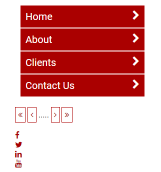

# Practice implementing responsive on an existing website

I've included two websites in the project.  One is a site already designed for desktop, but no mobile. The other is an existing mobile website that needs to look better on a desktop browser.

## Part 1 - Desktop first

In the DesktopFirst you'll find a website that acts as a gallery of sorts.  It has some hard defined widths and scroll bars appear on the screen when the browser is too small.

Update the existing CSS to make the content appear more mobile friendly.  Use Max-Width media queries and work form large resolutions downwards.

The end result should be have similar to (this site)[https://worthyd.github.io/dummy-sites/responsive-demo/], but it does not need to be exact.

## Part 2 - Mobile first
In the MobileFirst folder you will find a website with mobile styles already being applied to it.  

Update the CSS and the HTML to make it render better on desktop.  Use Min-Width media quires and max-width CSS to help make this look better on desktop.

The desired layout should look something similar to (this)[https://worthyd.github.io/dummy-sites/mobile-first-result] when viewed at a desktop resolution, but does not have to exactly match.
## Part 3 - Custom Fonts - Do all this work inside the Fonts folder

### Part 3.1 
Make the font of index.html 'Roboto'. Get the font off of Google fonts.

### Part 3.2
- Download [http://fontawesome.io/](http://fontawesome.io/) and add a reference to it in index.html
- Add a `chevron-right` to each link in the nav menu and position it to the right of the link 
- Replace the following in the div that has the class of pager
  - &lt;&lt; with an `angle-double-left`
  - &lt; with an `angle-left`
  - &gt; with an `angle-right`
  - &gt;&gt; with an `angle-double-right`
- Replace each social link with a copy of their respective social icons.

### Part 3.1 and Part 3.2 Result

