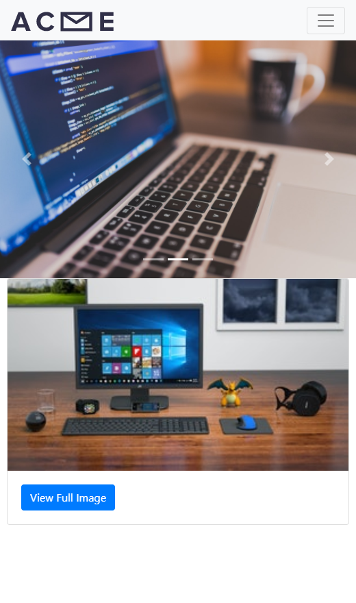

# Exercise 25 - Bootstrap Components

## Part 1 - Build a Nav

Add a navigation component to the page.  It needs to fulfill the following requirements.
- Contain the following links
    - Logo - using images/logo.svg
    - Home
    - About
    - Products - this has a drop down menu
        - Product 1
        - Product 2
- Uses the light color theme
- Expands at the 'md' size

## Part 2 Carousel

Use the images in the images that start with 'slide' for your carousel.
- Must use all 3 slides
- Show controls
- Show page indicator

## Part 3 Modals

- Create a card that meets the following requirements.
    - The card has a top image. It uses the thumb.jpeg image.
    - The card body contains a button that says "View Full Image"
    - There is already a style that will apply a max width to the card. Use bootstrap's utility classes to aut align the image on the x axis.
- Create a modal
    - The modal opens when the "View Full Image" is clicked.
    - The modal only contains the "full.jpeg" image in the `.modal-content` container.

## Screen Shots

### Desktop

### Desktop - Modal Open

### Mobile 

### Mobile - Modal Open

